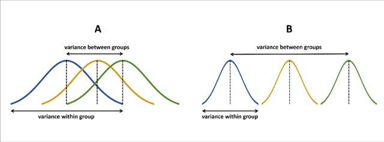

```{r include=FALSE}
knitr::opts_chunk$set(warning = FALSE,message = FALSE, cache = FALSE, results = "hold")
options(scipen=999, max.print = 50)
rm(list=ls())
options(knitr.kable.NA = '')
```

**Libraries**
```{r include=FALSE}
library(dplyr)
library(summarytools)
library(sjlabelled)
library(ggplot2)
library(ggExtra)
library(lme4)
library(texreg)
```

```{r xaringanExtra-clipboard, echo=FALSE}
htmltools::tagList(
  xaringanExtra::use_clipboard(
    button_text = "<i class=\"fa fa-clipboard\"></i>",
    success_text = "<i class=\"fa fa-check\" style=\"color: #90BE6D\"></i>",
  ),
  rmarkdown::html_dependency_font_awesome()
)
```

**Descargar:**

- [Datos .dta](https://stats.idre.ucla.edu/stat/stata/examples/mlm_ma_hox/popular.dta)
- [Rscript](https://jciturras.github.io/ayudantia-sol3051/rscript/00-intro-r.R)

</div>

**Contenidos ayudantía**
 
1. Modelo Nulo y Correlación Intraclase
2. Varianza within/between 
3. Modelos con intercepto aleatorio
4. Modelos con intercepto y pendiente aleatoria
5. Interacciones:
    A) Nivel individual
    B) Nivel cruzado


**Datos**

Los datos de popularidad en `popular` son datos simulados para 2000 alumnos en 100 escuelas. El propósito es ofrecer un ejemplo muy simple para el análisis de regresión multinivel. La principal variable dependiente es la popularidad del alumno, medida a través un índice de popularidad en una escala del 1 al 10 a través de un procedimiento sociométrico.

 
Por lo general, un procedimiento sociométrico pide a todos los alumnos de una clase que califiquen a todos los demás alumnos y luego asigna a cada alumno el índice de popularidad promedio recibido.

* Debido al procedimiento sociométrico, los efectos de grupo como son evidentes en los componentes de varianza de nivel superior son bastante fuertes.

* Hay una segunda variable de resultado: la popularidad del alumno según la calificación de su maestro, en una escala del 1 al 10.

* Las variables explicativas son el sexo del alumno (hombre = 0, mujer = 1), la extraversión del alumno (escala de 10 puntos) y la experiencia del profesor en años.

**Cargar Datos**

```{r echo=TRUE}
popdata <-read_spss("popular2.sav")
```

```{r, include=F}
popdata<- popdata %>% select(pupil,class,popular,sex,extrav,texp)
```


**Descriptivos**
```{r echo=FALSE}
print(dfSummary(popdata, headings = FALSE), method = "render")
```

# Contenidos

## Componentes de Varianza (within/between) 



* En el caso A, vemos que al interior de los grupos la varianza es **alta**, pero la varianza entre grupos es **baja**.

* En el caso b, vemos que al interior de los grupos la varianza es **baja**, pero la varianza entre grupos es* *alta**.


Ahora, ejemplifiquemos con nuestros datos. Seleccionamos tres cursos para observar cómo se distribuye la popularidad de los alumnos al interior de cada uno y a la vez, es posible identificar la variacion entre cursos. En este caso **La media de popularidad en la muestra es de `r mean(popdata$popular)`.**

```{r}
popdata %>% 
  filter(class %in% c(82,74,33)) %>%
  group_by(class) %>% 
  summarise(mean_j=mean(popular),var_j=var(popular),sd_j=sd(popular)) %>% data.frame()
```

```{r, fig.height=5,fig.width=12}
popdata %>% filter(class %in% c(82,74,33)) %>% 
  ggplot() + 
  geom_density(aes(x = popular,fill=factor(class,levels = c(82,74,33))),alpha=0.3) +
  geom_vline(xintercept = mean(popdata$popular),color="red",linetype="dashed", size=1) +
  ylab("Densidad")+
  xlab("Popularidad alumno") +
  scale_fill_discrete("ID Curso")+
  theme_classic()+ 
  theme(legend.position = "top")
```

* Por un lado vemos que el curso 33 es la que posee un promedio más alto, siguiendo la curso 74 y luego 82 Por otro lado, vemos que el curso 2 es aquella que posee menor variación al interior, e contraste de la escuela 1 y 11.

**Ahora, veamos la variación entre escuelas (between):** 

```{r}
popdata <- popdata %>%  mutate(mean_i=mean(popular))  # media muestral
popdata <- popdata %>%  group_by(class) %>% mutate(mean_j=mean(popular)) # media para grupos
```

```{r, fig.height=5,fig.width=12}
p<- popdata %>% 
  ggplot() +
  geom_point(aes(y = mean_j,x = class)) +
  geom_hline(yintercept = 5.03,color="red") +
  ylab("Media popularidad (Curso)")+
  xlab("ID Curso")+
  theme_classic() + 
  geom_text(data=subset(popdata, class %in%c(82,74,33)),
            aes(y = mean_j,x = class,label=class),
            nudge_x = -1,
            nudge_y = -0.1, 
            color="blue")
ggMarginal(p, type="box",margins = 'y',fill = '#00A2FF81', size=20) 
```

En este gráfico se puede observar la variación de los promedios de popularidad por curso, donde la línea roja horizontal representa la media total de la muestra, es decir, la media para todos los alumnos de todos los cursos.

## Modelo nulo 

El "modelo nulo" refiere al modelo que no considera ningún predictor, pero sí considera la estructura anidada de los datos.  

```{r}
m00<-lmer(popular ~ (1|class), popdata)
summary(m00)
```

En el output vemos dos parte centrales: 

1. __`Random effects` (parte 'aleatoria'):__ Nos muestra la variabilidad correspondiente a nivel 'intra' o individual (within) y a nivel 'entre' grupal (between).

2. **`Fixed effects` (parte 'fija'):** Muestra los valores del intercepto y los coeficientes o pendientes (slopes) . Para referirse a estos términos se habla de 'efectos fijos' en referencia a los parámetros del modelo como en un modelo de regresión tradicional.

En base a esta información podemos calcular la correlación intra-clase (ICC por Intraclass correlation). Medida que representa la proporción de la varianza de popularidad que es explicada por la pertenencia a unidades de nivel 2, que en este caso son los cursos. Para ello, utilizamos la información contenida en `Random effects`.

```{r}
sigma2_mu <- VarCorr(m00)$class[[1]]
sigma2_e <- sigma(m00)^2
```

Tenemo que la correlación intraclase se calcula con:

$\rho = \frac{\sigma_{\mu_0}^2}{\sigma_{\mu_0}^2+\sigma_{\epsilon}^2} = \frac{0.879}{0.879+0.638}=$ 

```{r}
sigma2_mu / (sigma2_mu+sigma2_e)
```

$\rho$ = `r round(sigma2_mu / (sigma2_mu+sigma2_e),3) `

**Interpretación**

La correlación intraclase nos indica que una proporción del **`r round(sigma2_mu / (sigma2_mu+sigma2_e),3) `** de la variable popularidad que es atribuible a la pertenencia a unidades de nivel 2. En este caso, sería la proporción atribuible a la varianza entre-escuelas (between)

**Visualización de efectos aleatorios**

```{r fig.show='hold', message=FALSE, warning=FALSE, out.width=c('50%', '50%'), fig.height=8}
library(lattice)
qqmath(ranef(m00, condVar = TRUE))

library(sjPlot)
plot_model(m00, #modelo
           type = "re", #tipo = random-effects
           sort.est = T, # ordenar = SI
           grid = FALSE) # mantener en 1 plot
```

## Modelo con intercepto aleatorio

A diferencia del modelo nulo, el modelo con intercepto aleatorio considera predictores en la estimación. Para este caso, utilizamos sexo (mujer=1), extraversión del alumno y la experiencia del profesor.

```{r}
m01.ri<- lmer(popular ~ sex + extrav + texp + (1 |class), popdata)
screenreg(list(m00,m01.ri))
```

**Interpretación**
> bla bla

## Modelo con intercepto y pendiente aleatoria

```{r}
m01.rirs<- lmer(popular ~ sex + extrav + texp + (1+ sex + extrav |class), popdata)
screenreg(list(m01.ri,m01.rirs))
```

**Interpretación**
> bla bla

## Interacciones

A) Nivel individual: sexo $\times$ extraversión 

```{r}
m02.rirs<- lmer(popular ~ sex * extrav + texp + (1+ sex + extrav |class), popdata)
screenreg(list(m00,m01.ri,m01.rirs,m02.rirs))
```


**Interpretación**

> 

B) Nivel cruzado: extraversión $\times$ experiencia profesor

```{r}
m03.rirs<- lmer(popular ~ sex + extrav*texp + (1+ sex + extrav |class), popdata)
screenreg(list(m01.rirs,m02.rirs,m03.rirs))
```

**Interpretación**

> bla bla


